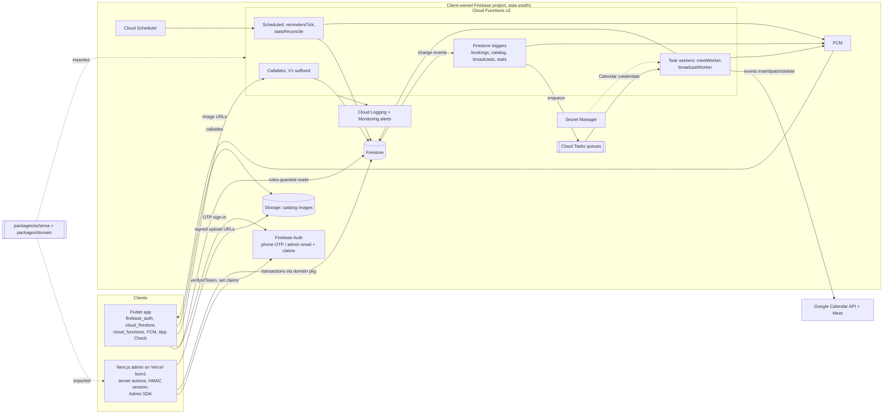

# FYT Integration & Build Plan: admin ↔ Firebase ↔ Flutter app

Date: 2026-09-29 · Status: DRAFT for review · Session TRN-20260928-c20456ad
Inputs: signed agreement (§2, §3, §5, §7.7, §8.1, §10, §11), `docs/DESIGN-v2.md`, `PRODUCT.md`, `DESIGN.md`, `apps/admin/src/**`.
Precedence: contract > this plan > DESIGN-v2. Anything marked **(rec)** is a recommendation, not a fact.

## 0. Summary

- The admin UI covers the contract's §2.7 scope. What's missing is everything behind it: persistence, Firebase Auth, Meet, FCM, reminders, stats. `src/lib/data/store.ts` is a per-process `globalThis` object, so on Vercel every serverless instance would hold its own copy of the data.
- The Flutter app should talk to **one backend contract**: direct Firestore reads for data it owns or that is public, and versioned callables for every write. The admin uses the **same domain code** (`packages/domain`) in its server actions, so the two clients can't drift.
- The booking core is a per-target, per-day **ledger doc** written in a Firestore transaction. Booking IDs are deterministic (idempotent). Meet links are created asynchronously through Cloud Tasks, with retries and a dead-letter path.
- Everything in phase (a) can be built **now on the Firebase Emulator Suite** (`demo-fyt` project) without waiting for the client's Firebase project.

## 1. Admin feature gap audit

The four in-flight features are assumed done: calendar filters, CSV export, availability exceptions + slot preview, image upload.

| Feature (source) | Status | Evidence | P1? |
|---|---|---|---|
| Secure login + RBAC (§2.7) | **Partial** | `lib/session.ts`, `lib/auth.ts`, `lib/rbac.ts`, `proxy.ts`. Passwords are scrypt hashes in the demo store. The login throttle is an in-memory `Map` (`login/actions.ts`), which is broken across instances. There is no Firebase Auth | Yes |
| CRUD institutes, courses/projects (§2.7) | Done | `catalog-actions.ts` (delete is blocked while upcoming bookings exist) | Yes |
| CRUD trainers/mentors/consultants (§2.4–2.6) | **Partial** | `types.ts` `Provider` has only `headline, expertise, rating`. Missing: bio/background, mentor `domain`, admin-entered review snippets, session info (length, format), and a venue for offline slots. The app's profile screens need all of these | Yes |
| Booking calendar + management (§2.7) | Done (UI) | `bookings/booking-calendar.tsx`, `bookings/actions.ts` | Yes |
| ↳ Meet link generation (§2.5) | **Missing** | `bookings/actions.ts` `meetCode()` fabricates random links | Yes |
| ↳ Cancel/reschedule integrity | **Partial** | Cancel doesn't release capacity or delete the calendar event. Reschedule takes any `datetime-local` value: it isn't checked against availability rules or capacity, and it doesn't patch the event | Yes |
| Availability per trainer/mentor (§2.7) | Done (UI) | `availability/actions.ts`. Slot generation must move to a shared package (§5) | Yes |
| Analytics + registrations (§2.7) | **Partial** | `lib/data/queries.ts` recomputes everything from full collections on each request. On Firestore that is slow and costs reads | Yes |
| Users list + segments (DESIGN-v2 §5.6) | Done | `learners/`. `Learner` has no education/experience history (§2.1) | Yes |
| Broadcasts (§2.8) | **Partial** | `audience-actions.ts` marks a broadcast `sent` without sending anything. Nothing dispatches `scheduled` broadcasts. `reach` is an estimate but is labelled as sent (this breaks PRODUCT.md's "honest numbers") | Yes |
| Session reminders (§2.8) | **Missing** (backend) | Only `settings.reminderMinutes` exists | Yes |
| Home feed + taxonomy | Done | `settings/actions.ts` `saveTaxonomy`, `content/` | Yes |
| Audit log | Partial | `store.ts` `audit()` is a separate write from the change it records. It must be atomic with the mutation | Yes |
| Team/invites | Partial | `team/actions.ts` returns an invite URL with the token baked into a password hash. Nothing is emailed | Yes |
| Maintenance mode / learner block | Admin side done; **app side missing** | `ownership/actions.ts`, `audience-actions.ts`. Nothing enforces either flag against the app | Yes |
| `meetProvider` setting | Misleading | `settings/actions.ts`. This is a deploy-time credential choice, so it shouldn't be a runtime toggle. Make it read-only | Yes |
| Account deletion | **Missing** (app + backend) | Not in the contract's list, but both stores require it (Apple 5.1.1(v), Google Play), and store submission is M7 | Yes (store gate) |

## 2. Target architecture

Rules of the road (rec):
- **Clients never write booking, slot, user-server, stats or audit data directly.** The app writes only through callables. The admin writes only through server actions that call `packages/domain`, which in turn uses the Admin SDK.
- **Side effects run only in Functions:** Calendar, FCM and email. Admin mutations set state, and a Firestore trigger (outbox pattern) runs the side effect. Calendar credentials therefore live only in Secret Manager, never on Vercel.
- **Co-locate everything in Mumbai.** Firestore, Functions and Storage go in `asia-south1`, and Vercel functions in `bom1`. This is what makes the <2 s admin load target (§10) realistic.

## 3. API contract (v1)

Envelope for every callable **(rec)**:
- Success returns `{ ...payload, requestId }`.
- Failure throws `HttpsError(code, userSafeMessage, details)`, where `details = { reason: ErrorReason, retryable: boolean, requestId, fieldErrors?: Record<string,string> }`.
- The app switches on `reason`, never on the message text.
- Every request carries `client: { appVersion, platform }`.

| # | Operation | Mechanism / name | Request → Response (abridged) | Auth | Idempotency | Error reasons | Admin? |
|---|---|---|---|---|---|---|---|
| 1 | Phone OTP sign-in | Firebase Auth SDK (no function) | `verifyPhoneNumber` → ID token | none → user | n/a | SDK: `invalid-verification-code`, `too-many-requests`, `quota-exceeded` | No |
| 2 | Read me + app config | Direct read `users/{uid}`, `config/public` | → `UserDoc`, `{maintenance, minAppVersion, taxonomy, featured, bookingLeadHours, cancellationWindowHours}` | user | n/a | `permission-denied` | No |
| 3 | Onboarding / edit profile | `saveProfileV1` | `{segment, name, email?, area, student?{institution, courseInterests[], desiredSkills[]}, corporate?{currentRole, yearsExperience, stackToLearn[]}, education[], experience[]}` → `{user}` | user | Full upsert (PUT semantics) | `VALIDATION_FAILED`, `USER_BLOCKED`, `APP_UPDATE_REQUIRED` | No |
| 4 | Catalog browse / search / filter | Direct read `catalogIndex/{institutes,courses,providers}` (1 doc each, maintained by a trigger); details from `institutes/{id}`, `courses/{id}`, `providers/{id}` | → `{items:[{id, title, category, techStack[], durationWeeks, area, specializations[], searchKeywords[], thumb, featured}], builtAt}` | user | n/a | `permission-denied` | Writes only (CRUD) |
| 5 | Slot availability | `getAvailabilityV1` | `{targetType, targetId, fromDate:'YYYY-MM-DD', days≤14}` → `{timezone:'Asia/Kolkata', slots:[{slotId, start, end, mode, remaining}]}` | user | Read-only | `LISTING_NOT_FOUND`, `VALIDATION_FAILED` | Yes: admin slot preview and the reschedule picker use the same generator |
| 6 | Create booking | `createBookingV1` | `{clientRequestId: uuidv4, slotId, mode, note?}` → `{booking, replayed}` | user, not blocked, profile complete | Booking ID = hash(uid + clientRequestId); a replay returns the existing booking | `SLOT_FULL`, `SLOT_NOT_OFFERED`, `LEAD_TIME`, `USER_OVERLAP`, `BOOKING_LIMIT`, `USER_BLOCKED`, `PROFILE_INCOMPLETE`, `MAINTENANCE`, `IDEMPOTENCY_MISMATCH`, `CONTENTION` (retryable) | No |
| 7 | My bookings | Direct query `bookings where userId==uid orderBy start` (realtime listener picks up the Meet link) | → `BookingDoc[]` | user (own only) | n/a | `permission-denied` | Reads all |
| 8 | Cancel | `cancelBookingV1` / admin `cancelBooking` | `{bookingId, reason?, opId}` → `{booking}` | owner of booking, or admin with `bookings` | Cancelling an already-cancelled booking returns it unchanged | `BOOKING_NOT_FOUND`, `INVALID_STATE`, `CANCEL_WINDOW_CLOSED` (users only) | **Shared** |
| 9 | Reschedule | Admin `rescheduleBooking`; app `rescheduleBookingV1` if the client wants it (decision D5) | `{bookingId, newSlotId, opId}` → `{booking}` | as #8 | `opId` stored on the booking; a repeat is a no-op | as #6 + #8 | **Shared** |
| 10 | Meet link | Internal: trigger → Cloud Tasks `meetWorker`. Admin `retryMeetLink` re-enqueues | booking `meet.status: pending → ok / failed` | system / admin | Calendar event `id` and `conferenceData.createRequest.requestId` derived from the booking ID, so a retry can't duplicate the event | worker-internal: `GOOGLE_4XX` (no retry), `GOOGLE_5XX/429` (retry) | Admin retry only |
| 11 | FCM token | `registerDeviceV1` / `unregisterDeviceV1` | `{token, platform, appVersion}` → `{ok}`. Server subscribes the token to topics `all` and `seg_<segment>` | user | Stored at `users/{uid}/devices/{sha256(token)}` | `VALIDATION_FAILED` | No |
| 12 | Reminders | `remindersTick` (Scheduler, every 5 min) | Confirmed bookings starting within each offset in `reminderMinutes` | system | Per-offset map `reminders: {"60": ts, "15": ts}` claimed in a transaction | logged only | Configured in admin settings |
| 13 | Broadcasts | Admin writes `broadcasts/{id}` → trigger enqueues `broadcastWorker` (immediately, or with `scheduleTime`) | status `queued → sent / failed`, `audienceSize` (not "reach") | admin `notifications` | Worker re-checks the status before sending, so a withdrawn broadcast never sends | logged, visible in admin | **Admin-only** |
| 14 | Delete account | `deleteAccountV1` | `{confirm: true}` → `{ok}`. Cancels future bookings, anonymises `users/{uid}`, deletes the Auth user | user (recent login) | Safe to repeat | `REAUTH_REQUIRED` | No |

Admin-only (server actions → `packages/domain`): catalog CRUD, availability rules + exceptions, `markOutcome`, manual offline confirm (if D5 keeps it), learner block, settings, team, ownership, audit/analytics reads.

**Booking engine (rec).**
- Slots are generated on read, not materialised (this replaces DESIGN-v2's `slots/{id}`). The generator reads `availability/{targetType_targetId}` (`{rules[], exceptions[]}`) and subtracts the ledger `slotLedgers/{targetType_targetId_yyyymmdd}`.
- `createBooking` is one transaction over the target (must be published), `config/public`, the user, the ledger and the deterministic booking ID. It re-checks that the slot is offered and has capacity, and **rejects any interval overlap for 1:1 targets**. Rules are held to 06:00–23:59, so one day's ledger is always enough.
- Status flow: online bookings go `requested` (slot held) → `confirmed` (link ready, push sent) or → `meet_failed`. Offline bookings go straight to `confirmed`. This matches the admin's existing enum and attention queue.

## 4. Shared schema strategy

**Source of truth (rec):** `packages/schema` holds **zod v4** schemas (the admin is already on `zod ^4.6.5`). It defines document schemas, callable request/response schemas and the `ErrorReason` enum.
- Types in the admin and in Functions come from `z.infer`. `apps/admin/src/lib/data/types.ts` becomes re-exports plus a few view-only types.
- Dart generation pipeline: `z.toJSONSchema(s, {target: "draft-7"})` → `packages/schema/json/*.json` → `quicktype --src-lang schema --lang dart` → `apps/mobile/lib/generated/`. The generated files are committed. CI regenerates them and fails on any diff.
- Contract tests: `packages/schema/fixtures/*.json` are real sample documents. The TS tests parse them with zod and the Dart tests decode them. **The fixtures are the contract.** If quicktype's output proves awkward (for example, how it handles enums), switch to hand-written `freezed` models held to the same fixtures.
- Time: store domain times as **epoch-ms ints**, which matches the admin today and generates cleanly to Dart. Use Firestore `Timestamp` only for TTL fields (`expireAt`). All slot math runs in IST, which has no DST. Generate each day as `Date.UTC(y, m, d) − 330 min + startMinute`, and test the day boundaries.

**Document versioning rule:** every doc carries `schemaVersion: int`.
1. Within a version, changes are additive only: add optional or defaulted fields; never rename, retype or remove.
2. Readers ignore unknown fields. **Unknown enum values decode to `unknown`**, and the app renders an "unknown" booking status as "Contact support", not a crash.
3. A breaking change needs all of the following:
   - a version bump;
   - an idempotent, batched migration script;
   - dual-read support for N and N−1;
   - dropping N only after `config/public.minAppVersion` has moved past every build that reads N.
4. Zod request schemas **strip unknown keys** instead of rejecting them, so a newer app never breaks an older function.
5. Deploy order is always schema → functions → admin → app release.

**Divergences to settle in schema v1** (the admin wins unless noted):

| Topic | Admin today | DESIGN-v2 | v1 choice |
|---|---|---|---|
| User ref | `learnerId` | `userId` | `userId` |
| Booking status | `requested, confirmed, completed, cancelled, no_show, meet_failed` | `…, failed` | admin set + `meet{status, link, eventId, attempts, lastError}` |
| Admin roles | owner / superadmin / admin | owner / editor | admin's three (update DESIGN-v2) |
| Availability | flat rules, `weekday/startMinute` | subcollection rules | one doc per target: `{rules[], exceptions[]}` |
| Devices | n/a | `fcmTokens[]` array | `devices` subcollection (stale tokens are pruned on FCM `not-registered`) |
| Reminders | n/a | single `reminderSentAt` | per-offset map |
| Stats path | n/a | `stats/daily/{date}` (invalid: an odd number of path segments) | `statsDaily/{yyyy-mm-dd}` |
| Config | `PlatformSettings` | `config/app` | `config/public` (readable by app) + `config/private` (admin only) |

## 5. Migrating the admin off the demo store

The honest starting point:
- 14 pages and 10 action files call `db()` directly.
- The `queries.ts` functions are **synchronous** and scan whole collections.
- A Firestore adapter "behind the same interface" is therefore not possible until the interface itself becomes async.

This work doesn't need Firebase, so do it first.

| Step | Change | Files |
|---|---|---|
| 1. Async repo (demo store) | Define `Repo` (`institutes.list/get/save/delete`, …, `bookings.query`, `mutate(actor, fn)`). Implement `MemoryRepo` over today's `Dataset`. Replace every `db()` with `await repo.…` | new `src/lib/data/repo.ts`; `store.ts`, `queries.ts`, the 14 `page.tsx` under `(console)`, `layout.tsx`, all `actions.ts`, `catalog-actions.ts`, `audience-actions.ts` |
| 2. Firebase Admin init | `server-only` module; switches to the emulator when `FIRESTORE_EMULATOR_HOST` is set | new `src/lib/firebase/admin.ts` |
| 3. `FirestoreRepo` | Same interface. Converters come from `@fyt/schema`. `mutate()` writes the change **and** `audit/{id}` in one transaction | new `src/lib/data/firestore-repo.ts`; `DATA_SOURCE` becomes env-driven (the header badge stays) |
| 4. Booking actions | Delete `meetCode()` and the local clash check. Call `@fyt/domain` (`cancel`, `reschedule`, `markOutcome`, `requestMeetRetry`) | `bookings/actions.ts` |
| 5. Availability + slot preview | Move validation and slot generation into `@fyt/domain`, keeping the same user-facing messages | `availability/actions.ts`, the preview component |
| 6. Analytics | Read `statsDaily` + Firestore `count()` aggregations | `queries.ts`, `analytics/page.tsx`, `(console)/page.tsx` |
| 7. Images | Server action issues a V4 signed PUT URL (with MIME and size limits) and records the Storage path. This avoids the 1 MB server-action body default (rec: verify against Next 16 docs) | the in-flight upload action |
| 8. Seed | `buildSeed()` becomes an emulator-only seeding script that refuses to run unless the project ID starts with `demo-` | `seed.ts` → `firebase/scripts/seed-emulator.ts` |

**Admin auth mapping (rec): keep the HMAC session cookie and make Firebase Auth the identity provider.**
- **Login.** The browser signs in with the Firebase JS SDK (email/password, optionally Google). It posts the ID token to the `login` action. The action:
  1. runs `verifyIdToken(token, true)` and requires a recent `auth_time`;
  2. loads `admins/{uid}` and rejects phone-only (learner) accounts;
  3. issues today's cookie, with `sub` set to the Firebase uid.

  The client then signs out of the Firebase SDK.
- **Why not Firebase session cookies:** their expiry is fixed (5 min–2 weeks) with no sliding 35-minute idle window, and `verifySessionCookie(…, checkRevoked)` makes a network call per request, which is too slow for `proxy.ts`.
- **Source of truth** stays `admins/{uid}`: `{role, permissions[], status, tokenVersion}`. The role is mirrored to a custom claim `{fytRole}` on every change, for defense-in-depth in the rules. Per-module permissions stay out of claims: claims are capped at 1000 bytes and go stale until the token refreshes.
- Role change, disable and "sign out everywhere" keep the `tokenVersion` bump and also call `setCustomUserClaims`, `updateUser({disabled})` and `revokeRefreshTokens`. An ownership transfer is a single transaction across both admin docs plus both sets of claims.
- An invite creates the Auth user plus `admins/{uid}` with status `invited`. `generatePasswordResetLink` becomes the invite link, and `accept-invite` becomes a set-password page.
- Delete the in-memory login throttle; Firebase Auth rate-limits sign-in itself. Keep auditing failed logins.
- **Files:** `lib/auth.ts`, `lib/session.ts` (minor), `(auth)/login/{actions.ts,login-form.tsx}`, `(auth)/accept-invite/*`, `team/actions.ts`, `ownership/actions.ts`, `profile/actions.ts` (password change), and `types.ts` (drop `passwordHash`). **Unchanged:** `proxy.ts`, `rbac.ts`.

## 6. Stability requirements: the "very stable" bar

| # | Requirement | Why it matters here | How to verify |
|---|---|---|---|
| S1 | Firestore + Storage rules: clients write nothing except through callables; the app reads own `users`, own `bookings`, published catalog, `catalogIndex`, `config/public` | Admin writes go through the Admin SDK, so the rules can be almost entirely deny-all and are easy to prove | `@firebase/rules-unit-testing` matrix of every collection × {anon, user, other user, blocked, admin-claim} × {get, list, create, update, delete}; 100% of cells asserted |
| S2 | Every booking write is a transaction over the ledger | Double-booking is the contract's core failure. The admin's current clash check is racy | Emulator test: 50 parallel `createBooking` calls on one 1:1 slot → exactly 1 success, 49 `SLOT_FULL`; also a reschedule racing a create |
| S3 | Idempotency: deterministic booking IDs, `opId` on cancel/reschedule, deterministic Calendar event IDs, Cloud Tasks task `id` dedupe | Flaky mobile networks retry; triggers fire at least once | Replay every callable 3× → one state change; fire each trigger twice → one Calendar event and one push |
| S4 | Zod validation at every boundary: callables, server actions, and trigger inputs (parse the doc before acting) | One schema serves three runtimes; bad data from an old build must fail loudly and early | Fuzz tests with fixtures + invalid mutations; a trigger meeting an unparseable doc logs `SCHEMA_VIOLATION` and never throws in a loop |
| S5 | Uniform error envelope + `ErrorReason` enum (§3) | The Flutter UX needs stable codes, not message strings | Contract test: every thrown error carries a `reason` from the enum; Dart exhaustively switches on it |
| S6 | App Check (Play Integrity / App Attest) on callables, Firestore and Storage; SMS region policy allowlisting +91 (verify availability on the project's Auth tier); per-user limits (max active bookings, attempts/hour) | Guards against OTP SMS-pumping cost spikes (contract §11 "Firebase cost spike") and booking spam | Monitor mode for 2 weeks, then enforce; a curl without an App Check token → 401; the 6th active booking → `BOOKING_LIMIT` |
| S7 | Versioned callables (`…V1`), additive changes only, `minAppVersion` gate | Store builds live for months; function deploys are instant | CI runs the previous release's fixture suite against the new functions |
| S8 | Google API retries: Cloud Tasks `maxAttempts 5`, backoff 10 s → 5 min; retry only 429/5xx; a 409 on insert means "already created" | The contract targets 100% Meet link generation (§10) and names Meet API change as a risk (§11) | Fake Calendar client that fails N times → confirmed for N<5, `meet_failed` at 5 |
| S9 | Dead-letter handling: after the final attempt, set `meet_failed`, write `deadLetters/{id}`, emit a log metric that alerts, and surface it in the admin attention queue | A failed link must reach a human before the session starts | E2E: forced failure → admin sees it within 1 min; `retryMeetLink` recovers it |
| S10 | Structured JSON logs (`requestId`, `uid`, `bookingId`, `fn@version`) + log-based metrics + alert policies (Meet failures, callable error rate > 2%, reminder lag, budget) | Contract §6.5 requires critical fixes within 4 h; that is impossible without alerts | Synthetic failure → email/SMS alert fires within 5 min |
| S11 | Backups: PITR + daily scheduled backups, plus one restore drill into a scratch database | Production data and audit history | Restore drill documented in the runbook before UAT |
| S12 | CI on every PR: typecheck, lint, domain unit tests, `firebase emulators:exec` (rules + functions integration), schema drift check, `flutter analyze/test` | Keeps the three clients honest against one contract | A required GitHub check on the client-owned org |
| S13 | Separate `fyt-dev` and `fyt-prod` projects | No testing against real learners | Deploy workflow targets dev by default; prod needs a manual approval |

## 7. Prioritised build order

Effort is rough, in dev-days for one senior developer.

**(a) Must be done before Flutter app work starts.** Target Oct 18, the end of M2. All of it is emulator-only.

| Item | Effort |
|---|---|
| A1. Monorepo scaffold: `firebase/`, `packages/schema`, `packages/domain`, `demo-fyt` emulator config, CI skeleton | 1.5 |
| A2. Schema v1 (settle §4 divergences, add the provider fields from §1) + JSON Schema + Dart codegen + fixtures | 3 |
| A3. API contract v1 frozen as `docs/API.md` + **schema-valid emulator stubs of every callable**, so the app can build against them | 1.5 |
| A4. Rules + rules test matrix + emulator CI job (S1, S12) | 2 |
| A5. Admin async-repo refactor (§5 step 1) + FirestoreRepo for catalog, content, availability and learners with atomic audit, so the admin fills the emulator the app reads | 4 |
| A6. `saveProfileV1`, `registerDeviceV1`, `deleteAccountV1`, `config/public`, `catalogIndex` trigger | 2 |
| **Total** | **≈14** |

**(b) In parallel with the app**, Oct 19 – Nov 22:

| Item | Effort |
|---|---|
| B1. Booking engine: generator, ledger, create/cancel/reschedule, concurrency tests. **Needed by Nov 8 (M4)** | 5 |
| B2. `meetWorker` + queue + DLQ + admin retry (S8, S9), plus a 1-day identity spike | 4 |
| B3. Booking pushes, `remindersTick`, `broadcastWorker`, topics | 2.5 |
| B4. Admin booking actions → domain; admin auth → Firebase Auth | 3 |
| B5. `statsDaily` triggers + nightly reconcile + analytics port | 2 |
| B6. Storage signed uploads; logging + metrics | 2 |
| **Total** | **≈18.5** |

**(c) Before launch**, by Dec 13 UAT:

| Item | Effort |
|---|---|
| App Check enforce | 0.5 |
| Alert policies + budget alerts | 1 |
| Backups + restore drill | 0.5 |
| Load/concurrency run + `/cso` rules review | 2 |
| Prod deploy pipeline, secrets, Vercel `bom1` | 1.5 |
| Real catalog import (§8.3) + demo purge + owner bootstrap script | 1.5 |
| API docs, runbook, KT (§6.3) | 1.5 |

**Against the DESIGN-v2 §7 timeline (honest read):**
- M5 (Nov 23 – Dec 6, "admin dashboard") is effectively free because the UI exists. It is the only real buffer; spend it on B4–B6 and part of (c).
- **M4 (Nov 9–22) is the risk.** B1 and B2 must land while the app wires up booking screens, and B2 hangs on D1 through the chain brand name → domain → Workspace → Meet identity. If D1 isn't settled by about **Oct 20**, M4 slips.
- (a) overlaps M1 design, and the contract says development starts after design approval. Backend infrastructure is defensible, but get the client's OK in writing, and have them approve the built console screens as the admin prototype.
- M6 (one week of QA + UAT) is tight. Run the S2/S8 suites continuously from B1 onward.
- These numbers assume one backend developer working next to at least one Flutter developer. Staffing isn't stated anywhere.

## 8. Open decisions and risks

| ID | Decision / risk | Owner | Blocks |
|---|---|---|---|
| D1 | **Meet identity:** Workspace + domain-wide delegation (rec) vs. an OAuth refresh token for one dedicated Gmail. With OAuth, an app left in "Testing" publishing status has refresh tokens that expire after 7 days, so it must be set to production. **Lobby risk:** phone-only learners without an invited email may land in "ask to join" with no host present. Spike before committing, and consider requiring an email for online bookings | Client + us | B2 / M4 |
| D2 | Firebase ownership/billing: client creates **both** `fyt-dev` and `fyt-prod` on Blaze in their name (§7.7, §8.1, overdue under the 3-day clause) and grants the vendor Owner. Budget alerts on | Client | Deploys (not dev work) |
| D3 | Region `asia-south1`, which is **irreversible** for Firestore. DPDP Act 2023: an in-country region is sensible but not strictly required. A privacy policy is needed for store listings (not legal advice) | Client | Project creation |
| D4 | Vercel → GCP credentials: a service-account key, or Workload Identity Federation with Vercel OIDC (rec). New GCP orgs may block key creation by policy | Us | A5 deploy |
| D5 | Booking semantics: auto-confirm offline or have the admin confirm (DESIGN-v2 risk #5)? A `meet_failed` hold policy (rec: hold, then auto-cancel at T−2h with notice)? Reschedule inside the app? Cancellation window value? | Client | B1 (by Oct 27) |
| D6 | Demo data: never migrated. `seed.ts` becomes emulator fixtures only. The `*@demo.local` accounts must never exist in prod. The owner is bootstrapped with the client's email | Us | (c) |
| D7 | Provider fields to add (§1): the client supplies bio, domain, review snippets and session info for the §8.3 data sheet | Client | A2 content |
| D8 | OTP SMS cost is not in the contract's §10.1 OPEX estimate (verify current pricing); restrict to +91 | Client | Launch budget |
| D9 | Roles: the console's owner/superadmin/admin vs. DESIGN-v2's owner/editor. Confirm and update DESIGN-v2 | Client | None (doc hygiene) |
